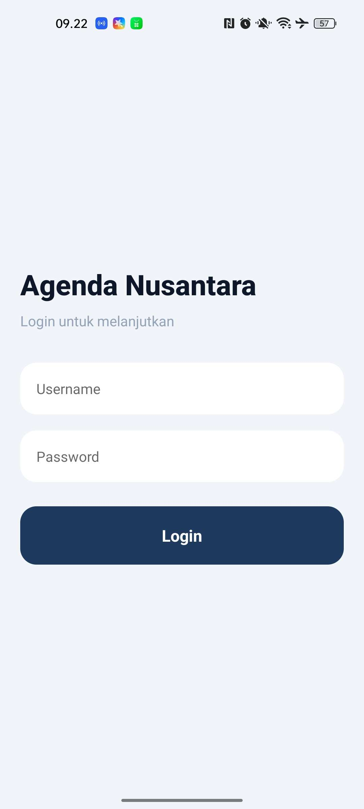
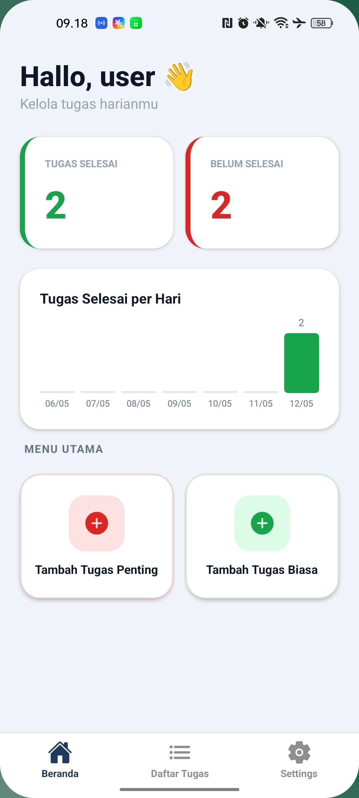
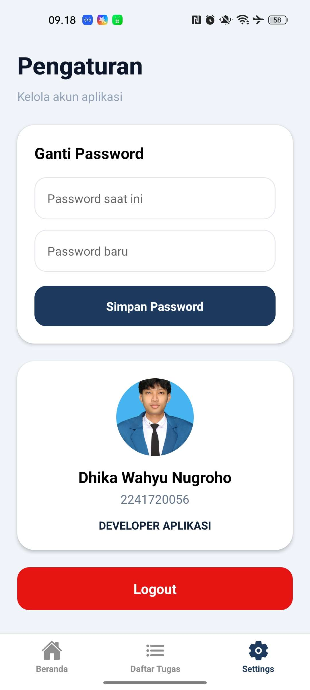

# Agenda Nusantara

Aplikasi manajemen tugas harian berbasis React Native dengan Expo, menggunakan SQLite sebagai penyimpanan lokal. Aplikasi ini dirancang untuk membantu pengguna mengelola tugas penting dan biasa dengan antarmuka yang modern, bersih, dan intuitif.

---

## Pratinjau Layar (Screenshots)

Berikut adalah tampilan antarmuka dari aplikasi Agenda Nusantara:

  
  
  
  

 

  
  

---

## Fitur Utama

Aplikasi ini dilengkapi dengan berbagai fitur fungsional untuk menunjang produktivitas:

* **Autentikasi Pengguna:** Sistem *Login* sederhana untuk keamanan akses data.
* **Dashboard Interaktif (Beranda):**
    * Menampilkan sapaan untuk *user* yang sedang aktif.
    * Kartu statistik jumlah **Tugas Selesai** dan **Belum Selesai**.
    * Visualisasi **Grafik Batang (Bar Chart)** yang menunjukkan tren penyelesaian tugas per hari.
* **Manajemen Tugas (CRUD):**
    * Menambahkan **Tugas Penting** (dengan tema warna merah).
    * Menambahkan **Tugas Biasa** (dengan tema warna hijau).
    * Setiap tugas dilengkapi dengan *Judul*, *Deskripsi*, dan *Tenggat Waktu (Deadline)*.
* **Daftar Tugas & Filter (Daftar List):**
    * Sistem *tab bar* untuk memfilter tugas berdasarkan kategori: **Semua**, **Penting**, dan **Biasa**.
    * Fitur *Checklist* untuk menandai tugas yang sudah selesai (teks akan dicoret otomatis).
    * Fitur Hapus (ikon tempat sampah) untuk membuang tugas dari *database*.
* **Pengaturan Akun & Profil:**
    * Formulir untuk mengubah *password* pengguna.
    * Tampilan profil *developer* aplikasi.
    * Fitur *Logout* untuk keluar dari sesi.

---

## Teknologi yang Digunakan

* [React Native](https://reactnative.dev/) — *Framework* UI utama
* [Expo](https://expo.dev/) + [Expo Router](https://docs.expo.dev/router/introduction/) — *Tooling* & Navigasi berbasis file
* [expo-sqlite](https://docs.expo.dev/versions/latest/sdk/sqlite/) — Manajemen *database* lokal langsung di perangkat
* [expo-safe-area-context](https://docs.expo.dev/versions/latest/sdk/safe-area-context/) — Penyesuaian *layout* untuk *notch*/*status bar*
* [TypeScript](https://www.typescriptlang.org/) — Pengetikan statis untuk kode yang lebih aman

---

## Prasyarat

Sebelum memulai, pastikan perangkatmu sudah ter-install perangkat lunak berikut:

* [Node.js](https://nodejs.org/) (versi 18 atau lebih baru)
* [npm](https://www.npmjs.com/) atau [yarn](https://yarnpkg.com/)
* [Expo Go](https://expo.dev/go) di HP (untuk *testing* langsung di perangkat fisik)
* [Android Studio](https://developer.android.com/studio) (Opsional, jika ingin menggunakan emulator PC)

---
